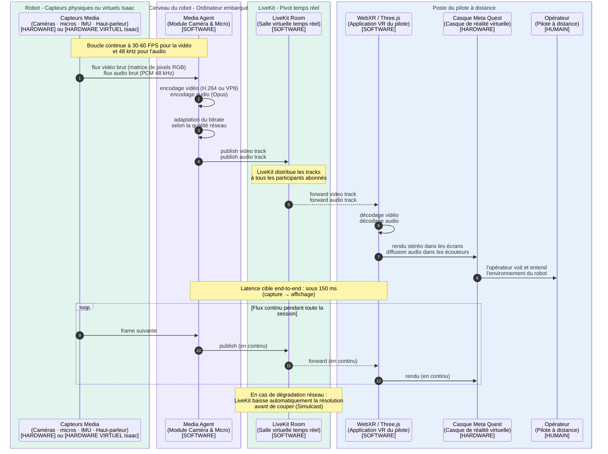

---

# P1 — Média immersif (vidéo et audio robot → opérateur)

## Ce que ce pipeline fait

Le P1 est le pipeline de **téléprésence** : il permet à l'opérateur, à distance dans son casque VR, de **voir** et d'**entendre** ce qui se passe autour du robot dans le supermarché. C'est l'équivalent de "regarder par les yeux du robot et écouter avec ses oreilles".

## Concrètement, qu'est-ce qui se passe ?

Le robot est équipé de capteurs média (caméras stéréo, micros, éventuellement lidar pour la profondeur). Ces capteurs produisent en continu :
- Un **flux vidéo** (typiquement 30 à 60 images par seconde, en résolution 1080p ou plus)
- Un **flux audio** (échantillonné à 48 kHz, mono ou stéréo)

Ces flux bruts sont récupérés par le **Media Agent** (Module Caméra & Micro), qui tourne dans le Cerveau du robot. Ce module fait trois choses :

1. **Encodage** : il compresse la vidéo (H.264 ou VP8) et l'audio (Opus) pour réduire la bande passante. La vidéo brute fait 1.5 Gbit/s, après encodage elle ne fait plus que 5-10 Mbit/s.
2. **Publication** : il pousse ces flux compressés dans LiveKit comme des "tracks" (pistes média).
3. **Adaptation** : selon la qualité du réseau, il ajuste automatiquement le bitrate (LiveKit gère ça nativement avec son Simulcast).

Côté pilote, le casque Quest s'abonne à ces tracks via l'application WebXR. LiveKit lui transmet les flux. L'application :

1. **Décode** la vidéo et l'audio
2. **Affiche** la vidéo dans le casque (en stéréo si caméras stéréo, sinon en mono)
3. **Diffuse** l'audio dans les écouteurs du casque

## Ce qu'il faut savoir techniquement

- **Latence cible** : sous 150 ms entre la capture par le capteur et l'affichage dans le casque. Au-delà, l'opérateur ressent un décalage gênant.
- **Encodage matériel** : si possible, utiliser un encodeur GPU (NVENC sur NVIDIA Jetson) pour ne pas saturer le CPU.
- **Audio bidirectionnel** : ce pipeline ne couvre que **robot → opérateur**. La voix de l'opérateur vers le robot est un autre cas (qui passe aussi par LiveKit mais avec d'autres acteurs).
- **Échec gracieux** : si LiveKit ralentit, la vidéo se dégrade (résolution baisse) avant de se couper. C'est le comportement standard WebRTC.

## Ce qui est volontairement absent de ce pipeline

- Pas de traitement IA (c'est P4)
- Pas de télémétrie (c'est P3)
- Pas de retour de commande (c'est P2)
- Pas de dialogue client (c'est P7)

Ce pipeline est volontairement **simple et performant** : son seul objectif c'est de transmettre le flux média en temps réel, sans logique métier ajoutée.

---

## Diagramme de séquence P1

````

````

---

## Comment lire ce diagramme

**Les boîtes colorées (`box rgb(...)`)** regroupent les acteurs par macro-zone :
- 🟢 Vert clair : tout ce qui est physiquement dans le robot (capteurs et LiveKit Room côté cloud)
- 🟣 Violet pâle : le Cerveau du robot (logiciel embarqué)
- 🔵 Bleu clair : le poste du pilote

**Les flèches solides (`->>`)** = appel direct
**Les flèches pointillées (`-->>`)** = retour ou diffusion asynchrone (LiveKit forwarde aux abonnés)
**Les `loop`** = action qui se répète en continu
**Les `Note over`** = informations contextuelles importantes (latence, comportement réseau)

**À retenir** : c'est un flux **purement descendant** (du robot vers l'opérateur), continu, avec adaptation automatique de la qualité.

---
