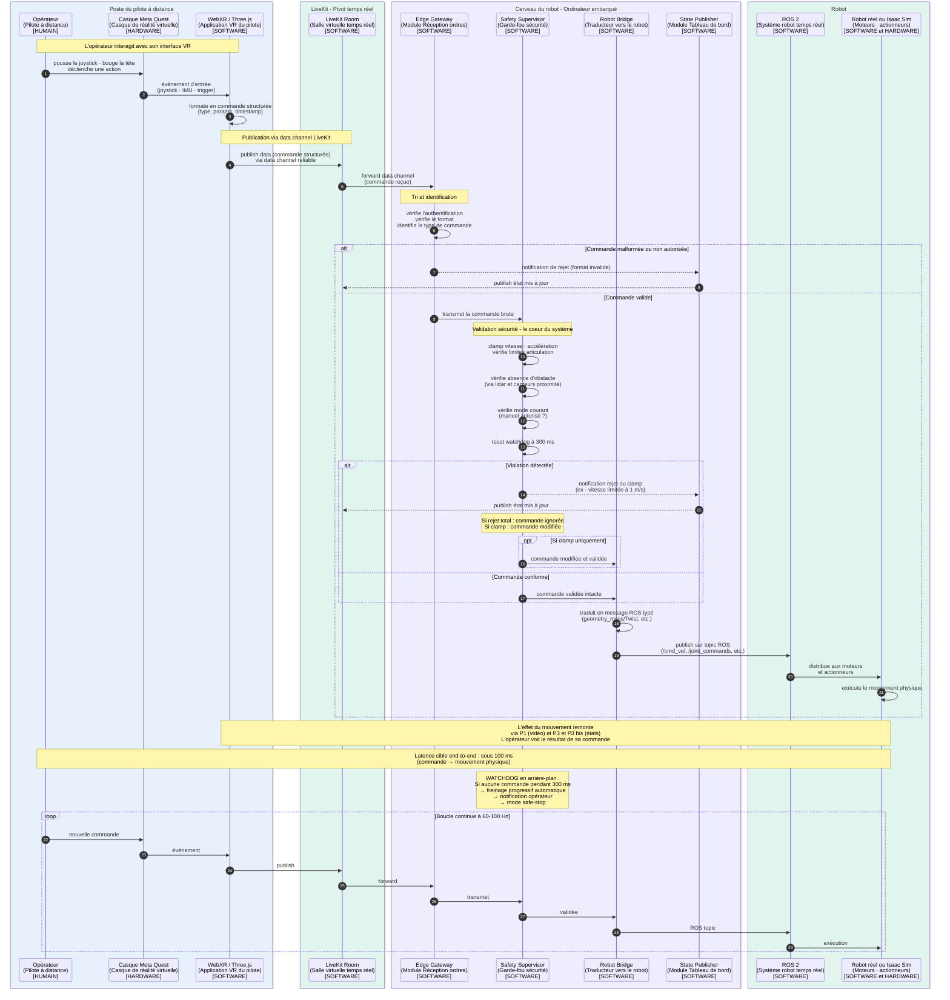

---

# P2 — Téléopération (commandes opérateur → robot)

## Ce que ce pipeline fait

Le P2 permet à l'opérateur, depuis son casque VR, de **piloter physiquement le robot** : avancer, reculer, tourner, bouger un bras, déclencher une action. C'est la traduction de **l'intention humaine** en **mouvement mécanique**.

C'est le flux **descendant critique** du système : tout ce qui sort du casque pour arriver dans les moteurs du robot.

## Concrètement, qu'est-ce qui se passe ?

L'opérateur génère des **commandes** via plusieurs interactions possibles :

| Type d'entrée | Source | Donnée produite |
|---|---|---|
| **Joystick gauche du Quest** | Bouton VR | Vitesse linéaire (avant/arrière, gauche/droite) |
| **Joystick droit du Quest** | Bouton VR | Vitesse angulaire (rotation) |
| **Mouvement de tête** | Capteurs IMU casque | Pose tête (orientation caméra) |
| **Mains/bras** | Trackers Quest | Pose bras du robot (si bras articulés) |
| **Boutons d'action** | Triggers Quest | Actions discrètes (saisir, lâcher, scanner) |

Ces commandes sont produites à **haute fréquence** côté pilote (60-100 Hz) et envoyées à LiveKit.

Le voyage d'une commande, étape par étape :

1. **L'opérateur fait un mouvement** (pousse le joystick)
2. **WebXR capte l'événement** et le transforme en message structuré
3. **WebXR publie dans LiveKit** via data channel
4. **LiveKit transmet** au Cerveau du robot (Edge Gateway)
5. **L'Edge Gateway trie et identifie** la commande (est-ce qu'elle vient bien d'un opérateur autorisé ? est-ce un format valide ?)
6. **Safety Supervisor** valide la commande (vitesse dans les limites ? pas d'obstacle proche ? mode actuel autorise ce type d'ordre ?)
7. **Si OK** → Robot Bridge traduit en commande ROS
8. **ROS** distribue aux moteurs/actionneurs
9. **Le robot bouge** physiquement
10. **L'état remonte** via P3 et P3 bis (en parallèle, pas dans P2)

## Le rôle critique du Safety Supervisor

C'est le **cœur sécuritaire** de ton système. Aucune commande n'atteint le robot sans son aval. Voilà ce qu'il fait sur chaque commande :

### Vérifications de bornes (clamping)
- **Vitesse** : si l'opérateur demande 5 m/s mais le robot est limité à 1 m/s en magasin, Safety **clampe** à 1 m/s (il ne rejette pas, il limite).
- **Accélération** : limite la dérivée de vitesse pour éviter les à-coups.
- **Angles articulation** : ne dépasse pas les butées mécaniques.

### Vérifications contextuelles
- **Mode courant** : si le robot est en mode autonome, les commandes opérateur sont bloquées (sauf un takeover explicite, voir P6).
- **Obstacles** : si lidar détecte une personne à 30 cm devant, Safety bloque tout mouvement avant.
- **État du robot** : si batterie critique, Safety force le mode "retour à la base".

### Vérifications de fraîcheur (watchdog)
- Si **aucune commande n'arrive depuis 300 ms**, Safety considère que la liaison est rompue et **freine progressivement** le robot. C'est le watchdog qu'on a défini.
- Heartbeat : l'opérateur doit envoyer un signal de vie même quand il ne pilote pas activement.

### Notifications
- Toute commande **rejetée** ou **clampée** est notifiée au State Publisher (P3) pour remonter à l'opérateur. L'opérateur voit "Vitesse limitée à 1 m/s par sécurité" dans son HUD.

## Pourquoi cette chaîne et pas un raccourci ?

Tu pourrais te demander : "pourquoi pas envoyer les commandes directement à ROS ?" Voilà pourquoi cette chaîne existe :

| Composant | Pourquoi il est nécessaire |
|---|---|
| **Edge Gateway** | Trier les commandes, vérifier l'authentification, formater. |
| **Safety Supervisor** | Garantir que rien de dangereux n'atteint les moteurs. **Non négociable.** |
| **Robot Bridge** | Traduire le format LiveKit (JSON/binaire) vers le format ROS (messages typés). |

Chacun a un rôle précis. Si tu fusionnes, tu perds en lisibilité, en testabilité, et surtout en sécurité.

## Le watchdog en détail

C'est un mécanisme **passif** mais **vital** :

```
   Commande arrive  →  reset timer à 300 ms

   Toutes les 10 ms : timer décrémente

   Si timer = 0  →  ALERTE
                 →  freinage progressif
                 →  notification opérateur
                 →  mode "safe stop"
```

Pourquoi 300 ms ? Parce que :
- À 60 Hz de commandes, on attend une commande toutes les 16 ms
- 300 ms = ~18 commandes ratées d'affilée
- C'est la limite "raisonnable" entre robustesse aux micro-coupures et réactivité

Ce chiffre peut être ajusté selon les tests terrain.

## Les types de commandes traités

Pour bien comprendre la diversité, voilà les commandes typiques :

| Commande | Format type | Topic ROS cible |
|---|---|---|
| `move_linear` | `{vx, vy, vz}` | `/cmd_vel` |
| `move_angular` | `{rotation_z}` | `/cmd_vel` |
| `set_arm_pose` | `{joint1, joint2, ...}` | `/joint_commands` |
| `gripper_action` | `{open/close}` | `/gripper/cmd` |
| `mode_switch` | `{mode: manual/auto}` | `/safety/mode` |
| `emergency_stop` | `{}` | `/safety/estop` |

## Ce qui n'est PAS dans ce pipeline

- Pas de commandes IA (c'est P5 - mode autonome)
- Pas de retour vidéo ou télémétrie (c'est P1 et P3)
- Pas de takeover (c'est P6, qui réutilise ce pipeline avec un signal de bascule)

---

## Diagramme de séquence P2

````

````

---

## Comment lire ce diagramme

**Quatre phases majeures :**

1. **Capture côté pilote** (étapes 1-3) : l'opérateur fait un mouvement, WebXR capte et formate.

2. **Transmission** (étapes 4-5) : la commande traverse LiveKit jusqu'au Cerveau du robot.

3. **Validation Edge Gateway** (étapes 6 + alt) : tri, authentification, format. Une commande malformée est rejetée ici, sans même arriver à Safety.

4. **Validation Safety + exécution** (étapes 7+) : c'est le cœur. Trois sous-cas :
   - **Rejet total** : commande ignorée + notification
   - **Clamp** : commande modifiée puis exécutée + notification
   - **OK** : commande exécutée intacte

**Les `alt / else / end` Mermaid** matérialisent les **décisions de routing** : selon la validité, le chemin diffère.

**Les `opt`** indiquent un cas optionnel (le clamp est une variante du rejet).

**Le `loop` final** rappelle que tout ce qui précède **se répète à 60-100 Hz**. Une commande toutes les 10-16 ms.

**Les `Note over`** soulignent les éléments critiques :
- La latence cible (100 ms)
- Le watchdog 300 ms et son comportement de fallback
- Le fait que le retour visuel passe par d'autres pipelines

---

## Points d'attention pour l'implémentation

Quelques détails techniques que tu rencontreras pendant l'implémentation :

1. **Timestamp dans chaque commande** : critique pour ignorer les commandes trop vieilles (out-of-order via réseau).
2. **Heartbeat séparé** : même si l'opérateur ne pilote pas, WebXR doit envoyer un heartbeat à 1 Hz pour que le watchdog ne se déclenche pas.
3. **Buffer côté Safety** : ne pas valider chaque commande indépendamment, mais en regardant l'historique récent (pour détecter des oscillations dangereuses).
4. **Mode dégradé** : si Safety perd la connexion à un capteur de proximité, il doit savoir s'il continue à autoriser les commandes ou s'il bascule en mode prudent.

Ces détails ne sont pas dans le diagramme (ils alourdiraient la lecture), mais à garder en tête pour la doc d'implémentation.

---
