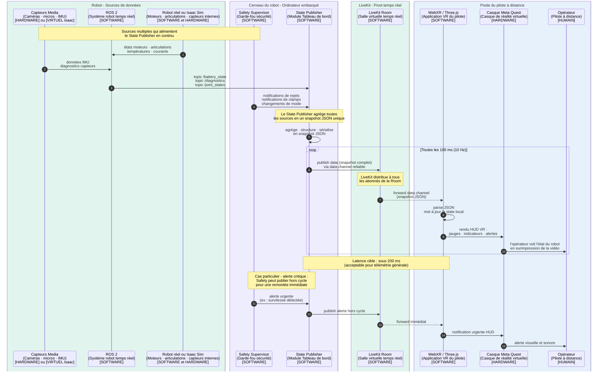

---

# P3 — Télémétrie générale (état du robot → opérateur)

## Ce que ce pipeline fait

Le P3 sert à **informer l'opérateur de l'état général du robot**, en continu, pendant toute la session. C'est ce qui alimente le **HUD** (Head-Up Display) dans le casque VR : les jauges, les indicateurs, les alertes que l'opérateur voit superposées à la vidéo.

Sans ce pipeline, l'opérateur ne saurait pas si la batterie est faible, si un moteur surchauffe, si le robot est en mode autonome ou manuel, si une alerte de sécurité a été déclenchée. Il pilote à l'aveugle sur ces aspects.

## Concrètement, qu'est-ce qui se passe ?

Le robot produit en permanence des **données d'état** de différentes natures et fréquences :

- **Batterie** : niveau, courant consommé, temps restant estimé (mise à jour 1 Hz)
- **Températures** : moteurs, contrôleurs, batterie (1 Hz)
- **Mode courant** : manuel, autonome, arrêt sécurité (changement événementiel)
- **Liste d'alertes actives** : surchauffe, perte de signal, obstacle détecté (changement événementiel)
- **État des articulations** : valeurs nominales (pas la pose temps réel qui est dans P3 bis)
- **Connexion réseau** : latence, qualité, FPS caméra
- **Notifications de Safety** : commandes rejetées ou clampées

Ces données arrivent depuis **plusieurs sources** différentes :
- Le **ROS 2** publie les données sur des topics (`/battery_state`, `/diagnostics`, `/joint_states`, etc.)
- Le **Safety Supervisor** publie ses notifications de rejet/clamp
- D'autres modules peuvent en ajouter au fil de la vie du système

Le **State Publisher** (Module Tableau de bord) est le composant qui :

1. **S'abonne** à tous ces topics ROS et flux d'événements
2. **Agrège** les données dans un **snapshot JSON unique**
3. **Publie** ce snapshot dans LiveKit à fréquence régulière (typiquement 10 Hz)

Côté pilote, l'application WebXR :
1. **Reçoit** le snapshot via LiveKit data channel
2. **Met à jour** les jauges, indicateurs, alertes du HUD
3. **Affiche** ces informations en surimpression de la vidéo dans le casque

## Pourquoi un module séparé qui agrège ?

Sans agrégation, on aurait 15 publishers différents qui spammeraient LiveKit chacun à leur rythme. C'est :
- Inefficace en bande passante (15 messages au lieu d'1)
- Difficile à synchroniser côté pilote (tu reçois la batterie, puis 50ms plus tard la température, etc.)
- Compliqué à maintenir (chaque module gère sa propre publication LiveKit)

Avec le State Publisher, on a **un seul flux propre, agrégé, structuré, à fréquence prévisible**. Le HUD côté pilote n'a qu'une seule source à écouter.

## Ce qu'il faut savoir techniquement

- **Fréquence** : 10 Hz typiquement. Pas besoin de plus pour de la télémétrie générale (la batterie ne change pas en 100 ms).
- **Format** : JSON pour la lisibilité, le debug, et la sérialisation native côté navigateur.
- **Channel** : LiveKit data channel **reliable** (TCP-like). On préfère la fiabilité à la latence pour ce flux. Si on perd un snapshot, ce n'est pas grave parce que le suivant arrive 100 ms après — sauf qu'on veut que les **alertes critiques** ne soient pas perdues, donc reliable est plus sûr.
- **Snapshot complet vs delta** : on envoie le **snapshot complet** à chaque tick. Plus simple à coder, et pour 10 Hz × quelques Ko = négligeable en bande passante.

## Différence avec P3 bis

| Aspect | P3 (télémétrie générale) | P3 bis (pose haute fréquence) |
|---|---|---|
| Fréquence | 10 Hz | 60-100 Hz |
| Données | Batterie, modes, alertes | Pose tête, mains, vitesse instantanée |
| Format | JSON | Binaire compact |
| Channel LiveKit | Reliable | Lossy (low-latency) |
| Usage | HUD opérateur | Synchro mécanique temps réel |

## Ce qui est volontairement absent de ce pipeline

- Pas de pose temps réel (P3 bis)
- Pas de commandes (P2)
- Pas de média (P1)

Ce pipeline est **purement informatif** et **purement descendant**.

---

## Diagramme de séquence P3

````

````

---

## Comment lire ce diagramme

**Trois phases dans le diagramme :**

1. **Phase d'alimentation** (étapes 1-5) : les différentes sources (ROS, Safety, capteurs) envoient leurs données au State Publisher. C'est continu mais représenté une fois pour la lisibilité.

2. **Phase d'agrégation et publication** (étape 6 + boucle) : le State Publisher fabrique un snapshot et le publie à 10 Hz. C'est le cœur du pipeline.

3. **Cas particulier - alerte critique** (à la fin) : pour les événements critiques, on ne veut pas attendre le prochain tick à 100 ms. Safety peut forcer une publication hors cycle. C'est un détail important pour la sûreté.

**Codes couleur** :
- 🟢 Vert clair : robot et LiveKit (le côté magasin)
- 🟣 Violet pâle : Cerveau du robot (logiciel embarqué)
- 🔵 Bleu clair : poste du pilote

**À retenir** : c'est un flux **purement descendant** (robot → opérateur), agrégé, avec une voie express pour les alertes urgentes.

---
