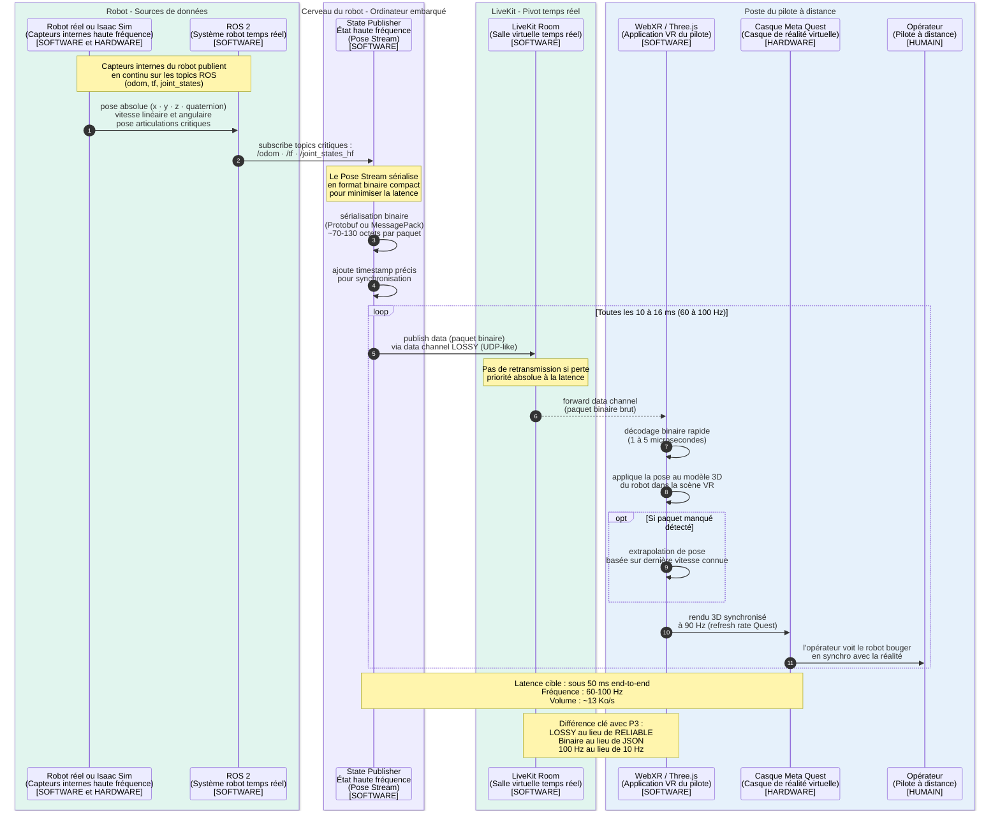

---

# P3 bis — Pose haute fréquence (low-latency state)

## Ce que ce pipeline fait

Le P3 bis est le **cousin haute fréquence** du P3. Il sert exclusivement à transmettre les **données de pose et de vitesse instantanées** du robot vers le casque VR de l'opérateur, avec une **latence minimale** et une **fréquence élevée**.

Là où P3 envoie un snapshot lent (10 Hz, JSON, batterie/alertes), P3 bis envoie un flux rapide (60-100 Hz, binaire compact, pose temps réel).

## Pourquoi un pipeline séparé ?

C'est exactement la question que tu m'as posée précédemment, et tu avais raison. Voilà la réponse en condensé :

**La synchronisation tête VR ne tolère pas la latence.** Si le casque attend la pose du robot pour réajuster ce qu'il affiche, et que cette pose met 100 ms à arriver, l'opérateur ressent un décalage qui provoque la **nausée** (motion sickness) en quelques minutes.

Pour que la téléprésence VR soit confortable :
- La fréquence de pose doit être au moins **60 Hz**, idéalement 90 Hz (refresh rate du Quest)
- La latence doit être **inférieure à 50 ms** (l'idéal étant sous 20 ms)

Avec le State Publisher classique (P3) qui agrège à 10 Hz et passe par un canal reliable, on serait à 100-200 ms en moyenne, ce qui rendrait l'expérience VR insupportable.

**D'où la nécessité d'un pipeline séparé**, optimisé pour la latence.

## Concrètement, qu'est-ce qui se passe ?

Le **Pose Stream Publisher** (State Publisher État haute fréquence) est un module software dans le Cerveau du robot qui :

1. **S'abonne à des topics ROS spécifiques et critiques** : `/odom`, `/tf`, `/joint_states_high_freq`, etc.
2. **Sérialise les données en format binaire compact** (Protobuf ou MessagePack), pas en JSON
3. **Publie dans LiveKit** via un **data channel "lossy"** (UDP-like, pas de retransmission)
4. **Tourne à 60-100 Hz** au lieu de 10 Hz

Côté pilote, l'application WebXR :
1. **Reçoit** les paquets binaires via LiveKit
2. **Décode** rapidement (binaire = beaucoup plus rapide que JSON)
3. **Applique** la pose au modèle 3D du robot dans la scène VR
4. **Optionnellement extrapole** la pose si un paquet manque (prédiction de mouvement)

## Les données transmises

Voici les données typiques transmises à haute fréquence :

| Donnée | Description | Volume |
|---|---|---|
| **Pose du robot** | Position (x, y, z) + orientation (quaternion) dans le monde | 28 octets |
| **Vitesse linéaire** | Vecteur de vitesse instantanée | 12 octets |
| **Vitesse angulaire** | Vecteur de rotation instantanée | 12 octets |
| **Pose articulations critiques** | Cou, tête, bras (si applicable) | 16-64 octets |
| **Timestamp** | Pour synchronisation et extrapolation | 8 octets |

Total par paquet : **70-130 octets**. À 100 Hz, ça fait 13 Ko/s. Négligeable en bande passante, mais critique en latence.

## Pourquoi binaire et pas JSON ?

Comparaison du même payload :

**Format JSON** :
```json
{"pose":{"x":1.234,"y":0.567,"z":0.890},"orientation":{"w":0.999,"x":0.012}}
```
≈ 80 caractères = 80 octets, mais surtout **le parsing JSON est lent** (50-200 µs).

**Format binaire (Protobuf)** :
```
[28 octets bruts]
```
Parsing : **1-5 µs**. 50× plus rapide.

À 100 Hz, économiser 100 µs par message = 10 ms par seconde de CPU économisées. Ça compte quand on chasse chaque milliseconde.

## Pourquoi data channel "lossy" et pas "reliable" ?

Dans LiveKit (et WebRTC en général), les data channels ont deux modes :

| Mode | Comportement | Latence | Pertes |
|---|---|---|---|
| **Reliable** | TCP-like, retransmet si perdu | Plus lente | Aucune |
| **Lossy** | UDP-like, perd si congestion | Plus rapide | Possibles |

Pour une pose à 100 Hz, **on préfère perdre un paquet de temps en temps que d'attendre sa retransmission**. Si le paquet n°47 est perdu, le n°48 arrive 10 ms après et il contient une pose plus à jour. La retransmission du n°47 serait inutile et bloquerait la suite.

C'est exactement comme la vidéo : on ne retransmet pas les frames perdus, on passe au suivant.

## Ce qui n'est PAS dans ce pipeline

- Pas de batterie, températures, alertes (c'est P3)
- Pas de commandes (c'est P2)
- Pas de vidéo (c'est P1)

Ce pipeline est **mono-tâche, optimisé latence**, c'est sa seule raison d'être.

## Note importante sur la latence physique

Même avec ce pipeline optimal, **la latence Internet** entre le robot et l'opérateur reste un facteur incompressible (typiquement 30-80 ms aller simple). Pour un robot dans le même magasin que l'opérateur, ça peut descendre sous 5 ms. Pour un opérateur à l'autre bout du monde, ça monte à 200-400 ms.

C'est pour ça que dans nos discussions précédentes on avait parlé de **caméra grand angle fixe** plutôt que de pose tête mécanique : pour découpler la latence réseau de la qualité visuelle. Mais ça, c'est un choix d'archi physique, pas software.

---

## Diagramme de séquence P3 bis

````

````

---

## Comment lire ce diagramme

**Phase 1 - Source des données (étapes 1-3)** : le robot publie ses poses et vitesses sur les topics ROS critiques. Le Pose Stream s'y abonne directement, sans agrégation lourde.

**Phase 2 - Préparation (étapes 4-5)** : sérialisation binaire pour la rapidité. Pas de JSON ici, on n'a pas le temps.

**Phase 3 - Boucle haute fréquence (étapes 6+)** : publication continue à 60-100 Hz via canal lossy. C'est le cœur du pipeline.

**Cas particulier - extrapolation** : si le casque détecte un paquet manqué, il **prédit** la pose en se basant sur la dernière vitesse connue. C'est ce qui permet de garder une animation fluide même avec quelques pertes réseau.

**Note finale** : le diagramme rappelle les **différences fondamentales avec P3** :
- Format : binaire vs JSON
- Channel : lossy vs reliable
- Fréquence : 100 Hz vs 10 Hz

Ces choix ne sont pas arbitraires, ils sont **dictés par la contrainte de latence VR**.

---
