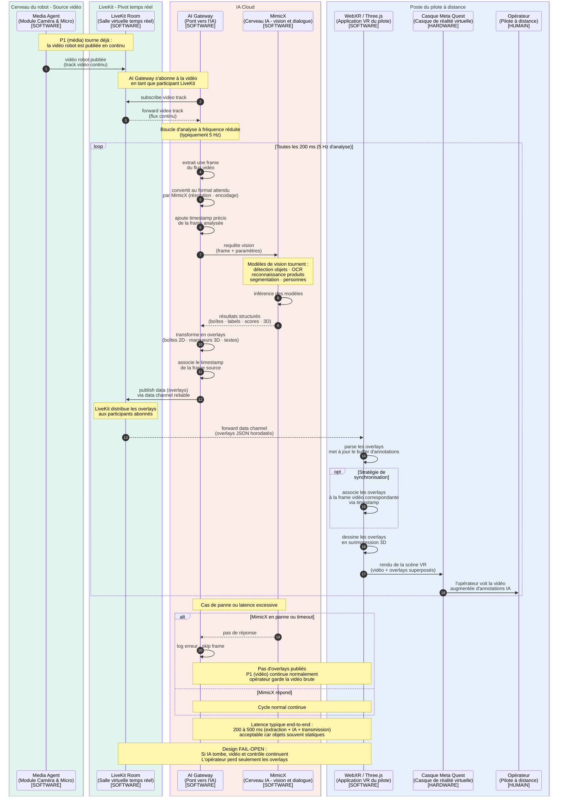

---

# P4 — Overlays IA (analyse vidéo et augmentation visuelle)

## Implémentation canonique

Le composant historiquement nommé **AI Gateway / MimicX** est désormais réalisé
par `services/perception-worker`. Il ne dépend pas d'un fournisseur unique : le
registre IA de l'API centrale lui transmet les modèles activés pour un robot et
le worker sélectionne un adaptateur par runtime. Le premier adaptateur livré est
Ultralytics YOLO (`.pt`), compatible avec les trois modèles de démonstration
documentés par l'équipe (`product_on_floor`, `dirty_floor`, `empty_shelf`).

Le contrat de sortie stable est `oscar.vision.overlay.v1`, publié sur le topic
LiveKit `oscar.vision.overlay` avec des boîtes `x/y/width/height` normalisées dans
`[0, 1]`. Les overlays sont non fiables car ils sont éphémères ; les incidents
confirmés seront, eux, persistés séparément par l'API centrale. Cette distinction
remplace la mention `reliable` de l'ancien diagramme pour éviter qu'un paquet
d'annotation ancien retarde le rendu temps réel.

Chaque paquet lossy est borné à 1 200 octets et conserve en priorité les
résultats les plus confiants. Cette marge respecte la recommandation LiveKit de
1 300 octets pour éviter la fragmentation au niveau du MTU.

## Ce que ce pipeline fait

Le P4 permet à l'**Intelligence Artificielle** de regarder ce que voit le robot, **comprendre** ce qui s'y trouve, et **renvoyer des informations contextuelles** qui sont superposées à la vidéo dans le casque VR de l'opérateur.

Concrètement, l'opérateur voit :
- La **vidéo brute** du robot (envoyée par P1)
- **Par-dessus**, des annotations dessinées par l'IA : boîtes autour des produits, étiquettes de prix détectées, flèches de guidage vers le rayon recherché, indicateurs de personnes détectées, marqueurs 3D sur les obstacles, etc.

C'est exactement comme la **réalité augmentée** : la vidéo réelle + des couches d'information dessinées par-dessus.

## Concrètement, qu'est-ce qui se passe ?

L'**AI Gateway** (Pont vers l'IA) est un participant LiveKit comme un autre. Il **s'abonne au flux vidéo** publié par le Media Agent (qui vient de P1).

Pour chaque frame ou groupe de frames :

1. **L'AI Gateway extrait des frames** de la vidéo (pas toutes — typiquement 1 sur 6 à 30 fps source, soit 5 Hz d'analyse)
2. **Envoie la frame à MimicX** (le cerveau IA — modèles de vision)
3. **MimicX analyse** : détection d'objets, reconnaissance de produits, OCR sur étiquettes, segmentation de scène, estimation de profondeur, reconnaissance de personnes
4. **MimicX renvoie les résultats structurés** : liste de boîtes englobantes avec coordonnées, labels, scores de confiance, parfois des coordonnées 3D
5. **L'AI Gateway transforme ces résultats en overlays** : structures de données qui décrivent ce qu'il faut dessiner et où
6. **Publie ces overlays dans LiveKit** via data channel
7. **WebXR côté pilote reçoit** les overlays et les **dessine en surimpression** de la vidéo dans la scène 3D

## Pourquoi 5 Hz et pas 60 Hz ?

C'est une question importante. Plusieurs raisons :

**Coût de calcul** : analyser une frame avec un modèle de vision moderne prend 50-200 ms sur un GPU cloud sérieux. Faire ça à 60 Hz coûterait une fortune et bloquerait le GPU.

**Pas besoin** : les objets dans un magasin ne se déplacent pas à 60 Hz. Les produits sur les étagères sont fixes, les personnes marchent à vitesse humaine. 5 Hz d'analyse + interpolation côté client donne un rendu fluide.

**Bande passante** : les overlays JSON à 5 Hz = quelques Ko/s. À 60 Hz ça deviendrait significatif.

L'approche retenue est : **analyse à fréquence réduite + expiration côté client**.
Le cockpit met les boîtes à jour à chaque paquet et les retire après 1,2 seconde
sans donnée fraîche, ce qui évite de présenter une détection ancienne comme
encore valide.

## Le rôle clé d'AI Gateway

L'AI Gateway n'est **pas** lui-même l'IA. Il est l'**intermédiaire** entre LiveKit et MimicX. Son rôle :

- **Connexion LiveKit** : il est participant, il publie/s'abonne comme tout le monde
- **Extraction de frames** : il décode la vidéo LiveKit et en extrait des images exploitables
- **Mise en forme** : il transforme les frames au format attendu par MimicX (résolution, encodage, batch)
- **Orchestration** : il pilote les appels à MimicX et gère les retours
- **Sérialisation des overlays** : il transforme les détections en structures envoyables

C'est essentiellement un **adaptateur** qui parle LiveKit d'un côté et qui parle l'API MimicX de l'autre.

## Les types d'overlays produits

Voici les overlays typiques que tu peux attendre :

| Type d'overlay | Description | Donnée transmise |
|---|---|---|
| **Boîte de détection 2D** | Rectangle autour d'un objet | `{x, y, w, h, label, confidence}` |
| **Étiquette texte** | Texte placé sur la scène | `{x, y, text, color}` |
| **Marqueur 3D** | Point 3D dans la scène VR | `{x, y, z, label}` |
| **Flèche directionnelle** | Indique une direction | `{from, to, color, type}` |
| **Zone surlignée** | Polygone à colorier | `{points[], color, opacity}` |
| **Reconnaissance produit** | Info enrichie | `{box, product_id, name, price}` |

Tous ces overlays sont **horodatés** avec le timestamp de la frame analysée, pour que WebXR puisse les **synchroniser** avec la vidéo correspondante.

## Le problème de synchronisation overlay/vidéo

C'est un point subtil. Quand l'IA renvoie ses résultats, **la vidéo affichée dans le casque a déjà avancé** de plusieurs frames. Si on dessine la boîte directement sur la vidéo actuelle, elle est en retard.

Deux stratégies :

**Stratégie A — Synchronisation par timestamp**
WebXR garde un buffer de quelques frames vidéo récentes. Quand l'overlay arrive avec son timestamp, WebXR identifie la frame correspondante et y associe l'overlay. Coûteux en mémoire mais précis.

**Stratégie B — Affichage best-effort**
WebXR affiche l'overlay sur la frame actuelle, en assumant que les objets n'ont pas trop bougé en quelques centaines de millisecondes. Plus simple, suffit dans 95% des cas (objets statiques).

Pour ton cas (magasin, objets fixes en majorité), **stratégie B** est largement suffisante.

## Si l'IA tombe en panne

C'est important : **le P4 est complètement optionnel**. Si MimicX plante ou si AI Gateway perd la connexion, **tous les autres pipelines continuent normalement**. L'opérateur perd les overlays, mais il garde la vidéo, le contrôle, la télémétrie.

C'est ce qu'on appelle un design **fail-open** : la perte de la couche IA ne dégrade pas la couche critique. C'est volontairement séparé pour cette raison.

## Ce qui n'est PAS dans ce pipeline

- Pas de commandes de pilotage (c'est P5 - autonomie)
- Pas de dialogue audio avec un client (c'est P7)
- Pas de vidéo brute (c'est P1, dont le P4 dépend)

Le P4 est **un pipeline d'analyse pure** : il observe, il annote, il ne pilote rien.

---

## Diagramme de séquence P4

````

````

---

## Comment lire ce diagramme

**Trois grandes phases :**

1. **Setup** (étapes 1-3) : la vidéo de P1 est déjà disponible. AI Gateway s'y abonne en tant que participant LiveKit. C'est exactement la même mécanique qu'un autre participant.

2. **Boucle d'analyse** (étapes 4+ dans le `loop`) : extraction de frame → analyse IA → fabrication d'overlay → publication → réception côté pilote → rendu superposé.

3. **Gestion d'erreur** (le `alt / else`) : si MimicX timeout, on saute proprement la frame. **Aucun autre pipeline n'est affecté**.

**Les `Note over` clés :**
- 5 Hz d'analyse (justifié par le coût IA)
- Latence 200-500 ms (acceptable pour des objets statiques)
- Design fail-open (la perte d'IA n'est pas critique)
- Stratégie de synchronisation par timestamp

**Les flèches pointillées (`-->`)** marquent les retours asynchrones (résultat IA, forward LiveKit).

**Le `--x`** marque un échec de communication (timeout, panne).

**Le `opt`** matérialise l'option de synchro fine par timestamp (stratégie A vs B mentionnée plus haut).

---

## Récap des 5 premiers diagrammes

À ce stade tu as :

| Pipeline | Sens du flux | Latence cible | Fréquence |
|---|---|---|---|
| **P1** Média immersif | Robot → Pilote | < 150 ms | 30-60 Hz |
| **P3** Télémétrie générale | Robot → Pilote | < 200 ms | 10 Hz |
| **P3 bis** Pose haute fréquence | Robot → Pilote | < 50 ms | 60-100 Hz |
| **P2** Téléopération | Pilote → Robot | < 100 ms | 60-100 Hz |
| **P4** Overlays IA | Robot → IA → Pilote | 200-500 ms | 5 Hz |

Tu remarques que **chaque pipeline a ses propres contraintes** : certains optimisent la latence (P3 bis), d'autres l'analyse (P4), d'autres la sécurité (P2). C'est pour ça qu'on les a séparés plutôt que de faire un seul tuyau monolithique.

---
