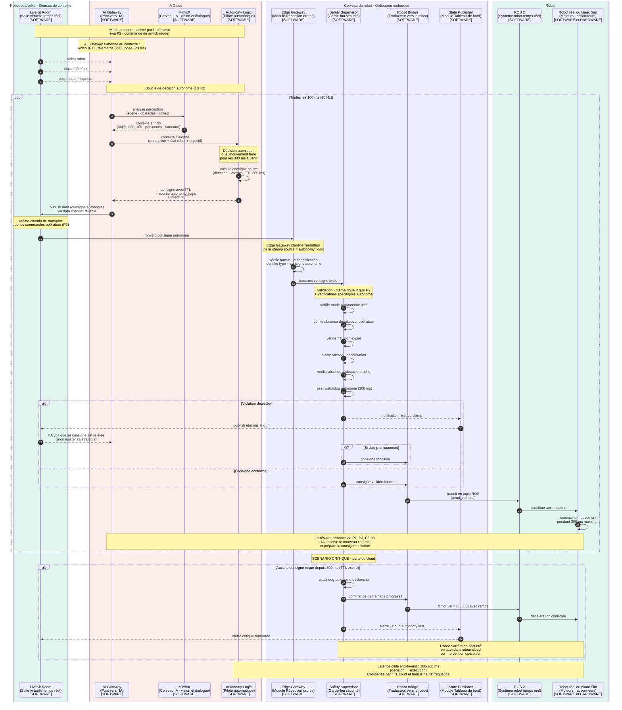

---

# P5 — Pilotage autonome (IA pilote le robot)

## Ce que ce pipeline fait

Le P5 permet au robot de **fonctionner sans intervention humaine** pour des tâches définies. L'IA analyse l'environnement (via P4), prend des décisions de navigation et d'action, et envoie des consignes au robot **toujours via le Safety Supervisor** — jamais directement.

C'est ce qui permet au robot de :
- **Guider un client** vers un rayon spécifique
- **Patrouiller** dans le magasin
- **Retourner à sa base** automatiquement quand la batterie est faible
- **Suivre une personne** qui demande de l'aide
- **Éviter des obstacles** dynamiquement

L'opérateur peut activer ce mode et **observer** ce qui se passe, voire **reprendre la main à tout moment** (c'est le P6).

## Concrètement, qu'est-ce qui se passe ?

L'**Autonomy Logic** (Pilote automatique) est le composant qui prend les décisions de pilotage. Voilà sa boucle de fonctionnement :

1. **Réception du contexte** depuis MimicX (perception visuelle de la scène) et depuis le State Publisher (état du robot)
2. **Décision de mouvement** : où aller, à quelle vitesse, dans quelle direction
3. **Production de consignes courtes** avec une **durée de validité** (TTL — Time To Live)
4. **Envoi via AI Gateway** vers LiveKit
5. **Réception côté Cerveau du robot** par l'Edge Gateway
6. **Validation par Safety Supervisor** — exactement le même chemin que les commandes opérateur
7. **Exécution** par le robot

**Important** : c'est exactement le **même chemin que P2** (téléopération), à partir de l'Edge Gateway. La différence est seulement **qui émet** : un humain (P2) ou l'IA (P5). Côté Safety, ça change peu de choses : il valide pareil, il clamp pareil, il refuse pareil.

## Le concept critique — Consignes courtes avec TTL

C'est le mécanisme qui rend le pilotage cloud **sécurisé**. On en a parlé précédemment, je résume.

**Mauvaise approche** (que tu ne veux **pas** faire) :
```
IA dit : "Va au rayon des pâtes" (commande longue, plusieurs secondes)
Robot reçoit, démarre la navigation
Réseau coupe pendant 2 secondes
→ Robot continue tout seul sans surveillance
→ Risque de collision ou de comportement non sûr
```

**Bonne approche** (ce que tu vas faire) :
```
IA dit : "Avance de 30 cm à 0.3 m/s — valable pour 300 ms"
Robot exécute pendant 300 ms maximum
IA renvoie une nouvelle consigne avant expiration
Si réseau coupe → consigne expire → Safety freine progressivement
```

C'est ce qu'on appelle des **consignes auto-expirantes**. Le robot ne fait jamais rien de plus que ce qu'on lui a dit pour les 300 ms à venir. Si l'IA disparaît, il s'arrête tout seul.

**Concrètement, le format d'une consigne ressemble à ça :**

```json
{
  "type": "move_velocity",
  "linear": {"x": 0.3, "y": 0.0, "z": 0.0},
  "angular": {"z": 0.1},
  "ttl_ms": 300,
  "issued_at": 1706789012345,
  "source": "autonomy_logic",
  "intent_id": "guide_to_pasta_aisle"
}
```

Le `ttl_ms` est **respecté par Safety**. Au-delà, la consigne est ignorée et le watchdog déclenche.

## Le flux complet d'une décision IA

Voilà l'enchaînement détaillé :

**Étape 1 — Perception** : L'IA observe le monde
- MimicX analyse la vidéo : détecte personnes, obstacles, rayons
- L'AI Gateway reçoit aussi la pose du robot (P3 bis) et la télémétrie (P3)
- Tout ce contexte est fusionné

**Étape 2 — Réflexion** : Autonomy Logic décide
- Quel est l'objectif courant ? (guider client, patrouille, retour base...)
- Quelle est la prochaine action atomique pour s'en rapprocher ?
- Quelle vitesse, quelle direction, quelle durée ?

**Étape 3 — Émission** : Production de consigne
- Format : commande courte avec TTL
- Envoi via AI Gateway → LiveKit
- Étiquetage : `source: autonomy_logic` pour que Safety sache d'où ça vient

**Étape 4 — Validation** : Safety vérifie
- Est-ce que le mode autonome est bien actif ?
- Pas de takeover opérateur en cours ? (sinon priorité humaine, voir P6)
- Vitesse dans les limites ?
- Pas d'obstacle imminent détecté ?
- Si tout est OK → laisse passer

**Étape 5 — Exécution** : Robot bouge
- Bridge traduit en commande ROS
- ROS distribue aux moteurs
- Le robot avance pendant 300 ms

**Étape 6 — Boucle** : ça recommence
- Pendant que le robot exécute, l'IA observe le nouveau contexte
- Et émet la consigne suivante avant expiration

## Différence cruciale avec P2

| Aspect | P2 - Téléopération | P5 - Autonomie |
|---|---|---|
| **Émetteur** | Opérateur humain | Autonomy Logic (cloud) |
| **Format** | Commandes basiques | Consignes avec TTL |
| **Watchdog** | 300 ms (heartbeat humain) | 300 ms (TTL consigne) |
| **Localisation** | Casque distant | IA Cloud distante |
| **Priorité** | Haute (human in the loop) | Basse (peut être préempté) |
| **Validation Safety** | Identique | Identique |

**Point clé** : Safety traite les deux de manière similaire, mais leur **priorité d'arbitrage** diffère. Si l'opérateur intervient pendant que l'IA pilote, **l'humain gagne toujours**. C'est exactement ce que P6 va matérialiser.

## Pourquoi l'IA est dans le cloud et pas dans le Cerveau du robot ?

C'est un choix qu'on a déjà discuté. Récap :

**Avantages cloud :**
- Modèles plus puissants (GPU dédiés)
- Itération rapide sans déployer sur chaque robot
- Mutualisation entre plusieurs robots
- Mises à jour centralisées

**Inconvénient cloud :**
- Dépendance réseau (latence + coupures)

**Compensation :**
- Consignes courtes avec TTL (pas de "trajectoire longue" envoyée)
- Watchdog côté Safety (300 ms et freinage automatique)
- Mode dégradé local (Safety peut au moins arrêter le robot proprement)

C'est un compromis assumé. Si tu veux plus de robustesse, tu peux **plus tard** ajouter une **mini-Autonomy locale** dans le Cerveau du robot pour les cas dégradés. Mais pour la V1, cloud-only est OK.

## Ce qui n'est PAS dans ce pipeline

- Pas de commandes opérateur (c'est P2)
- Pas de takeover (c'est P6, qui interrompt P5)
- Pas d'overlays vidéo (c'est P4, qui partage MimicX mais ne pilote pas)

Le P5 est **focalisé sur la décision et l'exécution autonomes**.

---

## Diagramme de séquence P5

````

````

---

## Comment lire ce diagramme

**Quatre phases distinctes :**

1. **Setup** (étapes 1-3) : AI Gateway s'abonne au contexte (vidéo, états, pose). C'est ce qui donne à l'IA sa connaissance du monde.

2. **Boucle de décision autonome** (étapes 4+ dans le `loop`) : à 10 Hz, l'IA analyse, décide, émet une consigne, qui est validée par Safety puis exécutée. C'est exactement la même chaîne que P2 à partir de l'Edge Gateway.

3. **Gestion des rejets** (le `alt / else`) : si Safety bloque ou clamp, **l'IA est notifiée via la télémétrie** (`STATE → LK → AIGW`) pour qu'elle puisse adapter sa stratégie. C'est important : l'IA apprend qu'elle a été refusée.

4. **Scénario critique** (le `alt` final) : que se passe-t-il si le cloud disparaît ? Le watchdog Safety s'enclenche, le robot freine progressivement, l'opérateur est alerté.

**Points visuels importants :**

- La **chaîne post-Gateway** est identique à P2 (Gateway → Safety → Bridge → ROS → Real). C'est volontaire et ça simplifie l'archi : un seul chemin sécurisé pour toutes les commandes.
- Les **flèches pointillées** vers AIGW dans la phase de rejet montrent que **l'IA reçoit du feedback** sur ses propres décisions (boucle d'apprentissage/adaptation).
- Le **scénario critique** est clairement matérialisé pour montrer la **résilience** du système face à une panne cloud.

---

## Points d'attention pour l'implémentation

Quelques détails techniques importants :

1. **Idempotence des consignes** : si une consigne est reçue deux fois (réseau qui dédouble), Safety doit la traiter comme une seule. Utiliser `intent_id` pour la dédup.

2. **Coordination perception/décision** : Autonomy Logic ne doit pas décider sur des données obsolètes. Tagger les inputs avec timestamps et rejeter les contextes trop vieux.

3. **Mode failsafe local** : pour la V2, tu peux mettre une mini-Autonomy locale qui sait au moins "se garer en sécurité" même sans cloud. Pour la V1, le freinage progressif suffit.

4. **Logs détaillés des décisions** : chaque consigne doit être loggée (pour debug, audit, training futur de l'IA).

---

## Récap des 6 diagrammes faits

| Pipeline | Sens du flux | Latence cible |
|---|---|---|
| **P1** Média immersif | Robot → Pilote | < 150 ms |
| **P3** Télémétrie | Robot → Pilote | < 200 ms |
| **P3 bis** Pose haute fréquence | Robot → Pilote | < 50 ms |
| **P2** Téléopération | Pilote → Robot | < 100 ms |
| **P4** Overlays IA | Robot → IA → Pilote | 200-500 ms |
| **P5** Pilotage autonome | IA → Robot | 100-200 ms |

**Tu remarques** que P5 partage la chaîne post-Gateway avec P2. C'est exactement ce qu'on voulait : **un seul chemin de validation sécuritaire** pour toutes les commandes, peu importe l'émetteur.

---
