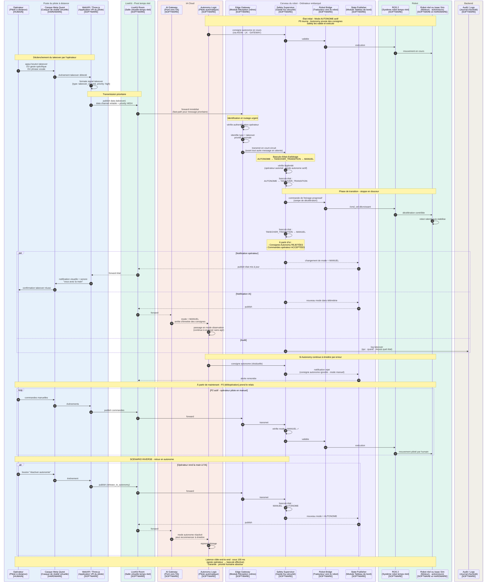

---

# P6 — Reprise en main opérateur (takeover)

## Ce que ce pipeline fait

Le P6 permet à l'opérateur d'**interrompre immédiatement le pilotage autonome** (P5) et de reprendre le contrôle manuel du robot. C'est la matérialisation de la règle d'or **"priorité humaine supérieure à autonomie IA"**.

C'est le pipeline de la **confiance** : l'opérateur sait qu'il peut, à tout moment, arrêter une décision IA qu'il juge mauvaise et reprendre le pilotage. Sans ce mécanisme, on aurait du mal à laisser l'IA piloter en toute sérénité.

## Concrètement, qu'est-ce qui se passe ?

L'opérateur est en mode supervision : le robot est en autonomie (P5 actif), il observe via son casque VR. À un moment, il décide d'intervenir parce que :

- L'IA fait quelque chose qu'il juge dangereux ou inadéquat
- Une situation imprévue survient (client qui demande de l'aide non détecté par l'IA)
- Il veut tester un comportement précis manuellement
- Il veut affiner une approche que l'IA fait mal (ex : approche d'un rayon)

L'opérateur **déclenche le takeover** par une action explicite :
- Un **bouton dédié** sur l'interface VR
- Un **geste spécifique** (ex : tirer le joystick fermement)
- Un **trigger physique** sur le casque
- Une **phrase vocale** ("je reprends la main")

Cette action déclenche un **signal de takeover** qui voyage jusqu'au Safety Supervisor et provoque un **changement d'état d'arbitrage**.

## Le rôle clé du Safety Supervisor en arbitre

Tu te souviens, on avait dit que P6 n'était pas vraiment un "nouveau pipeline" mais plutôt un **changement d'état dans Safety**. Voici concrètement ce qui se passe.

Safety Supervisor maintient en permanence une **machine à états** qui détermine **qui peut piloter le robot** :

```
État ARBITRAGE = AUTONOME
    → Accepte les consignes d'Autonomy Logic
    → Rejette les commandes opérateur (sauf signaux spéciaux)

État ARBITRAGE = MANUEL
    → Accepte les commandes opérateur
    → Rejette les consignes d'Autonomy Logic

État ARBITRAGE = TAKEOVER_TRANSITION
    → État transitoire (quelques ms)
    → Safety stoppe doucement les consignes IA
    → Bascule vers MANUEL une fois sécurisé
```

Le takeover est donc **une transition d'état** dans Safety, pas un nouveau chemin de commandes. Une fois en mode MANUEL, c'est le P2 classique qui s'applique.

## Le flux détaillé du takeover

Voilà ce qui se passe étape par étape quand l'opérateur déclenche un takeover :

**Étape 1 — Déclenchement** : L'opérateur appuie sur le bouton ou fait le geste
- WebXR détecte l'événement
- Formate un message spécial : `{type: "takeover_request", priority: "high"}`

**Étape 2 — Transmission urgente** : Le message voyage avec priorité élevée
- Publication dans LiveKit data channel
- Marqué comme **prioritaire** (les autres messages peuvent être retardés, pas celui-là)

**Étape 3 — Réception et identification** : Edge Gateway le reconnaît
- Vérifie l'authentification de l'opérateur
- Identifie le type "takeover" → priorité maximale
- Transmet immédiatement à Safety **en court-circuitant la file normale**

**Étape 4 — Bascule d'état dans Safety** : Le cœur du mécanisme
- Safety reçoit le takeover
- Vérifie que c'est légitime (opérateur authentifié, mode autonome actuellement actif)
- Bascule l'état d'arbitrage : `AUTONOME → TAKEOVER_TRANSITION`
- Stoppe doucement les consignes IA en cours (rampe de freinage si en mouvement)
- Bascule vers `MANUEL` une fois stabilisé
- **À partir de maintenant, les consignes Autonomy sont rejetées**

**Étape 5 — Notification de tous les acteurs** :
- L'opérateur reçoit confirmation : "vous avez la main" (visuel + audio dans le casque)
- L'IA est informée : "mode manuel actif, je suspends" (Autonomy peut continuer à observer mais arrête d'émettre des consignes)
- L'audit logge l'événement (qui a pris la main, quand, depuis quel état)

**Étape 6 — Le P2 prend le relais** : Maintenant l'opérateur pilote
- Toutes les commandes opérateur sont traitées via P2
- L'IA reste en arrière-plan, observe, mais n'agit plus

## Le retour vers le mode autonome

Inversement, l'opérateur peut **rendre la main à l'IA** :
- Soit explicitement : "réactive le mode autonome"
- Soit après inactivité prolongée : si pas de commande pendant N secondes, retour auto à l'autonomie (configurable)

Ce retour passe par le même mécanisme : un signal qui modifie l'état d'arbitrage de Safety, dans l'autre sens.

## Garanties critiques du takeover

**Garantie 1 — Latence minimale**
Le takeover doit aboutir en **moins de 100 ms** entre le geste de l'opérateur et la bascule d'état effective dans Safety. Au-delà, la confiance s'effrite. Pour ça :
- Le message takeover est marqué prioritaire dans LiveKit
- Edge Gateway le route en fast-path (pas de queue)
- Safety le traite avant tout autre message

**Garantie 2 — Pas de mouvement chaotique**
Pendant la transition d'état, le robot ne doit pas avoir de comportement bizarre :
- Si le robot était en mouvement IA, on freine doucement (pas un stop brutal qui ferait basculer le robot)
- Une fois immobile ou stabilisé, on bascule en manuel
- Cette transition prend typiquement 100-500 ms selon la vitesse en cours

**Garantie 3 — Toujours possible**
Même si le réseau cloud est dégradé (IA partiellement disponible), le takeover doit fonctionner :
- Safety est local dans le Cerveau du robot
- Le signal opérateur passe par LiveKit → Gateway → Safety, **sans dépendance au cloud IA**
- Si la liaison opérateur ↔ Safety est intacte, le takeover marche

**Garantie 4 — Audit complet**
Chaque takeover est tracé dans l'Audit :
- Qui a déclenché (identifiant opérateur)
- Quand (timestamp précis)
- Depuis quel état (mode autonome ? quelle intention IA en cours ?)
- Comment (bouton, geste, vocal)

C'est essentiel pour le debug, la conformité, et l'amélioration future.

## Différence avec l'arrêt d'urgence

À ne pas confondre avec un **emergency stop** (arrêt d'urgence) :

| Aspect | Takeover (P6) | Emergency Stop |
|---|---|---|
| **Action sur le robot** | Bascule manuel + opérateur pilote | Arrêt total immédiat |
| **Latence cible** | < 100 ms | < 50 ms |
| **Continuité** | L'opérateur continue d'agir | Robot complètement immobile |
| **Cas d'usage** | Préférence humaine | Danger imminent |

L'emergency stop est un autre mécanisme (commande dans P2 avec priorité absolue) qui **stoppe** au lieu de **basculer**. Le takeover suppose que l'opérateur veut continuer à utiliser le robot, juste autrement.

## Ce qui n'est PAS dans ce pipeline

- Pas de pilotage continu (c'est P2 qui prend le relais après le takeover)
- Pas de pilotage IA (P5 qui se met en pause)
- Pas d'arrêt d'urgence (c'est une commande spéciale dans P2)

P6 est **un pipeline d'arbitrage** : il change qui pilote, pas comment on pilote.

---

## Diagramme de séquence P6

````

````

---

## Comment lire ce diagramme

**Cinq grandes phases :**

1. **État initial** (étapes 1-3) : on rappelle que le P5 tourne, l'IA pilote.

2. **Déclenchement du takeover** (étapes 4-7) : geste de l'opérateur capturé et formaté.

3. **Transmission prioritaire et bascule** (étapes 8-15) : le signal arrive en fast-path à Safety qui change d'état avec une transition douce (freinage progressif).

4. **Notifications parallèles** (le bloc `par`) : tous les acteurs concernés sont prévenus en parallèle :
   - L'opérateur reçoit la confirmation
   - L'IA passe en mode observation
   - L'audit logge l'événement

5. **Continuation** : P2 prend le relais. Le diagramme se termine avec le scénario inverse (rendre la main à l'IA) pour montrer que c'est symétrique.

**Concepts visuels nouveaux dans ce diagramme :**

- **Le `par / and / and`** : matérialise le **parallélisme** des notifications. Trois actions se font en même temps après la bascule, pas séquentiellement.
- **Le scénario "consigne résiduelle ignorée"** : montre la robustesse — si l'IA tarde à recevoir le changement de mode et continue à émettre, Safety ignore quand même.
- **Le `loop` P2 actif** : rappelle que c'est exactement le P2 qui prend le relais, pas un nouveau pipeline.

---

## Points d'attention pour l'implémentation

1. **Choix des déclencheurs** : le takeover doit avoir un déclencheur **fiable et difficile à activer par accident**. Un bouton dédié est plus sûr qu'un mouvement de joystick.

2. **Feedback immédiat** : l'opérateur doit **savoir** que son takeover a réussi. Latence critique. Vibration du contrôleur + son + visuel.

3. **Test de l'aller-retour** : tester en boucle takeover → release → takeover → release pour s'assurer qu'il n'y a pas de deadlock.

4. **Comportement en cas de double émetteur** : que se passe-t-il si **deux opérateurs** sont connectés et un seul fait takeover ? Politique à définir : single-pilot ou multi-pilot avec priorités ?

5. **Limite de fréquence** : empêcher les takeovers à répétition (anti-flapping). Minimum N secondes entre deux changements d'état.

---

## Récap des 7 diagrammes faits

| Pipeline | Sens du flux | Latence cible | Particularité |
|---|---|---|---|
| **P1** Média immersif | Robot → Pilote | < 150 ms | Streaming continu |
| **P3** Télémétrie | Robot → Pilote | < 200 ms | JSON agrégé 10 Hz |
| **P3 bis** Pose haute fréquence | Robot → Pilote | < 50 ms | Binaire 100 Hz |
| **P2** Téléopération | Pilote → Robot | < 100 ms | Validation Safety |
| **P4** Overlays IA | Robot → IA → Pilote | 200-500 ms | Fail-open |
| **P5** Pilotage autonome | IA → Robot | 100-200 ms | TTL 300 ms |
| **P6** Reprise en main | Pilote → Safety (état) | < 100 ms | Priorité humaine |

---
