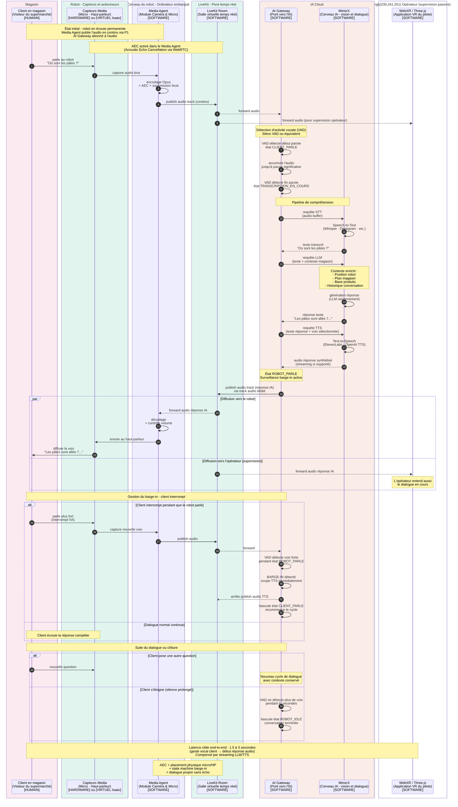

---

# P7 — Conversation autonome client en magasin

## Ce que ce pipeline fait

Le P7 permet à un **client humain présent physiquement dans le magasin** de **dialoguer vocalement** avec le robot, de manière autonome (sans qu'un opérateur ait besoin de répondre). Le robot écoute, comprend, répond.

C'est ce qui permet des cas d'usage comme :
- "Où sont les pâtes ?" → "Allée 7, troisième rayon à gauche"
- "Tu peux m'accompagner au rayon des yaourts ?" → "Bien sûr, suivez-moi"
- "Quels produits sont en promotion aujourd'hui ?" → "Voici les principales offres..."
- "C'est quoi cette odeur ?" → réponse contextuelle

C'est aussi le pipeline qui **différencie ton robot d'un simple véhicule téléopéré** : il devient un **assistant magasin** intelligent.

## Concrètement, qu'est-ce qui se passe ?

Tu m'avais demandé de simplifier en supprimant le Voice I/O Handler. Je le fais. Donc l'audio passe directement par le **Media Agent** et **LiveKit** comme participant — l'IA est juste un autre participant LiveKit qui écoute et qui parle.

Voilà le flux complet :

**Étape 1 — Le client parle**
- Le client s'approche du robot
- Il parle à voix haute : "Où sont les pâtes ?"

**Étape 2 — Capture et transmission**
- Le micro physique du robot (Capteurs Media) capte la voix
- Le Media Agent encode l'audio (Opus)
- Publication dans LiveKit comme track audio

**Étape 3 — Détection de fin de parole**
- L'AI Gateway, abonné au flux audio, détecte qu'il y a de la voix (VAD — Voice Activity Detection)
- Il accumule l'audio jusqu'à détecter une pause significative (fin de phrase)
- Cette détection se passe en temps réel pendant que le client parle

**Étape 4 — Transcription (Speech-to-Text)**
- L'AI Gateway envoie l'audio à MimicX (ou un service STT comme Whisper/Deepgram intégré)
- Retour : texte transcrit "Où sont les pâtes ?"

**Étape 5 — Compréhension et génération de réponse**
- MimicX traite le texte avec un modèle de langage (LLM)
- Contexte ajouté : géolocalisation du robot, plan du magasin, base de produits, historique éventuel
- Génère une réponse texte : "Les pâtes sont allée 7, troisième rayon à gauche"

**Étape 6 — Synthèse vocale (Text-to-Speech)**
- L'AI Gateway envoie le texte à MimicX (ou un service TTS comme ElevenLabs/OpenAI)
- Retour : audio synthétisé (Opus ou WAV)

**Étape 7 — Diffusion**
- L'AI Gateway publie l'audio de réponse dans LiveKit
- Le Media Agent (abonné à cet audio) reçoit la réponse
- Envoie l'audio au haut-parleur physique du robot
- Le client entend la réponse

## Le rôle du VAD (Voice Activity Detection)

C'est un point technique crucial. Sans VAD, l'AI Gateway devrait :
- Soit envoyer l'audio en continu à MimicX (coûteux et inefficace)
- Soit attendre un déclencheur explicite (mot-clé "Hey OSCAR" comme Alexa)

Avec VAD, l'AI Gateway détecte automatiquement :
- **Quand le client commence à parler** → démarre l'enregistrement
- **Quand il fait une pause significative** → fin de phrase, lance la transcription

Le VAD est typiquement une **petite IA légère** (Silero VAD par exemple) qui tourne en temps réel sur le flux audio. Très peu coûteux en calcul.

## Le problème de l'écho — résolu par WebRTC

On en a parlé en détail précédemment. Quand le robot parle via son haut-parleur, son propre micro capte la voix. Sans traitement, l'IA s'entend elle-même et boucle.

**Solution : AEC (Acoustic Echo Cancellation) activé dans le Media Agent** via les options LiveKit/WebRTC :

```python
audio_options = AudioCaptureOptions(
    echo_cancellation=True,
    noise_suppression=True,
    auto_gain_control=True,
)
```

C'est **trois flags** qui résolvent 90% du problème. Les 10% restants sont gérés par :
- **Placement physique** du micro et du haut-parleur (loin l'un de l'autre)
- **Volume raisonnable** du haut-parleur
- **Gestion de barge-in** dans la state machine de dialogue (voir ci-dessous)

## La state machine du dialogue

Pour qu'un dialogue soit **fluide et naturel**, il faut gérer plusieurs états :

```
État ROBOT_IDLE
    → Écoute le micro en continu
    → VAD surveille la voix client

État CLIENT_PARLE (VAD a détecté de la voix)
    → Accumule l'audio
    → Attente de la fin de phrase

État TRANSCRIPTION_EN_COURS
    → STT en train de tourner
    → On ne capture plus de nouvelle phrase

État GENERATION_REPONSE
    → LLM génère la réponse
    → On peut commencer le TTS en streaming si supporté

État ROBOT_PARLE
    → Audio TTS en cours de lecture par le haut-parleur
    → AEC activement filtre l'écho
    → VAD surveille un éventuel barge-in (client qui interrompt)

Transition ROBOT_PARLE → CLIENT_PARLE (barge-in)
    → Si voix forte détectée pendant que robot parle
    → Coupe immédiatement le TTS
    → Passe en mode écoute
```

Cette state machine vit dans l'**AI Gateway** (côté cloud). C'est l'avantage de centraliser : on a une vue cohérente du dialogue.

## L'opérateur peut écouter et intervenir

Point intéressant : puisque tout passe par LiveKit, **l'opérateur entend aussi le dialogue en cours**. Il peut :

- **Écouter passivement** (par défaut) pour superviser
- **Intervenir vocalement** s'il juge que l'IA répond mal (sa voix passe par P1 retour, et le robot la diffuse)
- **Prendre la main** sur le dialogue (similaire au takeover P6)

C'est un avantage clé de l'architecture **tout-passe-par-LiveKit** : pas de silos.

## Latence acceptable pour un dialogue naturel

Pour qu'un dialogue paraisse naturel à un humain, voici les seuils :

| Phase | Latence acceptable |
|---|---|
| Détection début parole | < 100 ms |
| Détection fin parole | 200-500 ms (silence requis) |
| Transcription (STT) | 500-1500 ms |
| Génération réponse (LLM) | 500-2000 ms |
| Synthèse vocale (TTS) | 200-800 ms (premier audio) |
| **Total perçu par client** | **1.5 à 3 secondes** |

Si on dépasse 3 secondes, le client commence à penser que le robot ne l'a pas entendu. C'est inconfortable.

**Astuce de réduction** : utiliser le **streaming** sur LLM et TTS — commencer à parler dès qu'on a les premiers mots de la réponse, sans attendre la phrase entière. Ça donne une **latence perçue** beaucoup plus faible.

## RGPD et consentement

Tu m'as dit que l'audio passait par LiveKit (donc cloud). Ça implique :

- **Affichage en magasin** : signalétique claire que le robot enregistre
- **Consentement** : politique d'usage à valider légalement
- **Rétention** : décider combien de temps les transcriptions sont conservées
- **Anonymisation** : pas de stockage de voix brute si possible
- **Droit à l'oubli** : pouvoir supprimer un enregistrement sur demande

Ce n'est pas dans le diagramme technique mais à inclure dans la doc projet.

## Ce qui n'est PAS dans ce pipeline

- Pas de pilotage du robot (sauf si l'IA décide de bouger après le dialogue → c'est P5 qui prendra le relais)
- Pas de communication avec l'opérateur (l'opérateur peut écouter passivement, mais le pipeline cible le client)
- Pas de vidéo (P7 est purement audio)

## Un point subtil — qui parle quand ?

Dans la Room LiveKit, il y a plusieurs **émetteurs audio possibles** :

- **Le Media Agent** publie l'audio robot (ce qui inclut la voix du client captée par le micro)
- **L'AI Gateway** publie l'audio TTS (la voix de réponse de l'IA)
- **L'opérateur** publie sa voix s'il parle

Côté Media Agent (qui doit envoyer l'audio au haut-parleur du robot), il faut **filtrer** : ne pas renvoyer au haut-parleur l'audio que le robot capte lui-même (sinon double écho). Concrètement, le Media Agent ne joue **que** l'audio des autres participants (AI Gateway, opérateur), pas le sien.

LiveKit gère ça nativement — un participant ne reçoit pas son propre flux par défaut.

---

## Diagramme de séquence P7

````

````

---

## Comment lire ce diagramme

**Cinq grandes phases :**

1. **Setup** : le robot est en écoute permanente, l'AI Gateway abonné à l'audio.

2. **Détection et transcription** (étapes 1-9) : client parle, VAD détecte, STT transcrit.

3. **Compréhension et génération** (étapes 10-13) : LLM réfléchit avec contexte enrichi, TTS produit la réponse vocale.

4. **Diffusion en parallèle** (le bloc `par`) : l'audio de réponse est envoyé **à la fois** au robot **et** à l'opérateur (qui entend aussi). C'est l'avantage du pivot LiveKit.

5. **Gestion du barge-in** (le `alt`) : si le client interrompt, le TTS est coupé immédiatement et on retourne en écoute. C'est ce qui rend le dialogue **naturel**.

**Concepts visuels nouveaux :**

- **Le `par`** : matérialise le **broadcast** vers le robot et l'opérateur en parallèle.
- **Le `--x`** : indique l'**arrêt** d'un flux en cours (TTS coupé lors du barge-in).
- **Les états du dialogue** sont annotés dans les `Note over` pour rappeler la state machine.

**Le diagramme se termine** par les deux scénarios de continuation : nouvelle question (cycle qui recommence avec contexte) ou silence prolongé (retour idle).

---

## Points d'attention pour l'implémentation

1. **Choix des modèles STT/LLM/TTS** : pour la V1, je recommande l'**OpenAI Realtime API** ou **Deepgram + GPT-4 + ElevenLabs**. Latence sub-2s atteignable.

2. **Streaming TTS critique** : ne pas attendre la phrase entière avant de diffuser. Le client doit entendre les premiers mots dans 800-1500 ms max.

3. **Barge-in robuste** : tester intensivement. Le pire UX c'est un robot qui continue de parler alors que le client essaie de l'interrompre.

4. **Timeout LLM** : si le LLM met plus de 3 secondes à répondre, prévoir une réponse de fallback ("un instant, je réfléchis...").

5. **Contexte de session** : garder la conversation en mémoire pendant toute la session magasin (pas juste une question isolée). Le LLM doit pouvoir faire référence aux échanges précédents.

6. **Multi-langue** : si ton magasin est international, prévoir la détection de langue dans le STT.

---

## Récap des 7 diagrammes faits

| Pipeline | Sens du flux | Latence cible | Particularité |
|---|---|---|---|
| **P1** Média immersif | Robot → Pilote | < 150 ms | Streaming continu |
| **P3** Télémétrie | Robot → Pilote | < 200 ms | JSON agrégé 10 Hz |
| **P3 bis** Pose haute fréquence | Robot → Pilote | < 50 ms | Binaire 100 Hz |
| **P2** Téléopération | Pilote → Robot | < 100 ms | Validation Safety |
| **P4** Overlays IA | Robot → IA → Pilote | 200-500 ms | Fail-open |
| **P5** Pilotage autonome | IA → Robot | 100-200 ms | TTL 300 ms |
| **P6** Reprise en main | Pilote → Safety (état) | < 100 ms | Priorité humaine |
| **P7** Conversation client | Client ↔ Robot via IA | 1.5-3 s | Bidirectionnel audio |

---
