```mermaid
sequenceDiagram
    autonumber

    box rgb(230,241,251) Poste du pilote à distance
        participant OP as Opérateur<br/>(Pilote à distance)<br/>[HUMAIN]
        participant QUEST as Casque Meta Quest<br/>(Casque de réalité virtuelle)<br/>[HARDWARE]
        participant WEBXR as WebXR / Three.js<br/>(Application VR du pilote)<br/>[SOFTWARE]
    end

    box rgb(241,239,232) Backend applicatif
        participant SESSION as Session Service<br/>(Service de connexion)<br/>[SOFTWARE]
        participant REGISTRY as Robot Registry<br/>(Annuaire des robots)<br/>[SOFTWARE]
        participant AUDIT as Audit / Logs<br/>(Journal d'activité)<br/>[SOFTWARE]
    end

    box rgb(225,245,238) LiveKit - Pivot temps réel
        participant LK as LiveKit Room<br/>(Salle virtuelle temps réel)<br/>[SOFTWARE]
    end

    box rgb(238,237,254) Cerveau du robot - Ordinateur embarqué
        participant CERVEAU as Cerveau du robot<br/>(Modules software embarqués)<br/>[SOFTWARE]
    end

    Note over OP,WEBXR: Démarrage de l'application VR

    OP->>QUEST: enfile le casque<br/>lance l'application
    QUEST->>WEBXR: démarrage app VR
    WEBXR->>WEBXR: affiche écran de connexion

    Note over OP,SESSION: Phase 1 - Authentification (HTTP)

    OP->>WEBXR: saisit identifiants<br/>(login · mot de passe · SSO · badge)
    WEBXR->>SESSION: POST /auth/login<br/>(credentials)

    SESSION->>SESSION: vérifie identité<br/>(base utilisateurs · LDAP · OAuth)

    alt Authentification refusée
        SESSION->>AUDIT: log tentative refusée<br/>(login · IP · timestamp)
        SESSION-->>WEBXR: 401 Unauthorized
        WEBXR->>QUEST: affiche erreur connexion
        Note over OP: Fin du flux - accès refusé
    else Authentification réussie
        SESSION->>AUDIT: log auth réussie
        SESSION-->>WEBXR: token de session<br/>(JWT court terme)
        WEBXR->>WEBXR: stocke token<br/>affiche sélection robot
    end

    Note over OP,REGISTRY: Phase 2 - Demande de session sur robot spécifique

    OP->>WEBXR: sélectionne le robot<br/>(ex - oscar_007)
    WEBXR->>SESSION: POST /sessions/create<br/>(robot_id, auth_token)

    SESSION->>REGISTRY: GET robot info<br/>(oscar_007)
    REGISTRY-->>SESSION: robot info<br/>(statut · localisation · capacités)

    SESSION->>SESSION: vérifie droits opérateur<br/>sur ce robot spécifique

    alt Robot offline ou indisponible
        SESSION->>AUDIT: log demande refusée<br/>(robot indisponible)
        SESSION-->>WEBXR: 503 Robot Unavailable
        WEBXR->>QUEST: affiche "robot non disponible"
    else Robot déjà occupé par un autre opérateur
        SESSION->>AUDIT: log conflit<br/>(robot occupé)
        SESSION-->>WEBXR: 409 Conflict<br/>(politique : refus / file d'attente / co-pilotage)
    else Droits insuffisants
        SESSION->>AUDIT: log accès refusé<br/>(droits insuffisants)
        SESSION-->>WEBXR: 403 Forbidden
    else Session autorisée
        Note over SESSION,LK: Phase 3 - Création de la salle LiveKit

        SESSION->>LK: crée Room dédiée<br/>(room_id = session_xyz)
        LK-->>SESSION: Room créée

        Note over SESSION: Phase 4 - Génération des tokens

        SESSION->>SESSION: génère token JWT opérateur<br/>(permissions publish + subscribe + data<br/>TTL 4 heures · signé)
        SESSION->>SESSION: génère token JWT robot<br/>(permissions publish + subscribe + data<br/>TTL session)

        Note over SESSION,REGISTRY: Phase 5 - Réservation du robot

        SESSION->>REGISTRY: marque oscar_007<br/>comme réservé pour session_xyz
        REGISTRY-->>SESSION: réservation OK

        Note over SESSION,CERVEAU: Phase 6 - Notification au robot

        SESSION->>CERVEAU: notify session<br/>(room_id, robot_token, livekit_url)<br/>via webhook ou MQTT

        CERVEAU->>CERVEAU: prépare ses modules<br/>(Media Agent · State Publisher · etc.)
        CERVEAU->>LK: connect avec robot_token
        LK-->>CERVEAU: connecté à la Room

        Note over SESSION,AUDIT: Phase 7 - Audit

        SESSION->>AUDIT: log session ouverte<br/>(operator_id · robot_id · session_id<br/>timestamp · IP · contexte)

        Note over SESSION,WEBXR: Phase 8 - Retour à l'opérateur

        SESSION-->>WEBXR: 200 OK<br/>{token, room_id, livekit_url}
        WEBXR->>WEBXR: stocke les infos de session
        WEBXR->>LK: connect avec operator_token
        LK-->>WEBXR: connecté à la Room

        Note over WEBXR,CERVEAU: PIPELINES TEMPS RÉEL DÉMARRENT<br/>P1 (média), P2 (commandes), P3 (états),<br/>P3 bis (pose), P4 (IA), P5, P6, P7

        WEBXR->>QUEST: affiche interface de pilotage
        QUEST->>OP: l'opérateur voit le robot<br/>session active
    end

    Note over OP,AUDIT: PENDANT LA SESSION - le backend est hors chemin

    Note over LK: Tous les flux temps réel passent par LiveKit<br/>Le backend n'est PAS sollicité<br/>S'il tombe, la session continue normalement

    Note over OP,SESSION: Cas particulier - renouvellement de token

    alt Token proche de l'expiration (ex - 5 min avant TTL)
        WEBXR->>SESSION: POST /sessions/refresh<br/>(current_token)
        SESSION->>SESSION: vérifie validité<br/>+ permissions toujours OK
        SESSION->>SESSION: génère nouveau token<br/>(TTL prolongé)
        SESSION->>AUDIT: log renouvellement
        SESSION-->>WEBXR: nouveau token
        WEBXR->>LK: update token<br/>(reconnexion transparente)
    end

    Note over OP,AUDIT: Phase finale - Fermeture de session

    alt Opérateur ferme volontairement
        OP->>QUEST: action "déconnexion"
        QUEST->>WEBXR: événement
        WEBXR->>SESSION: POST /sessions/close<br/>(session_id)
    else Inactivité prolongée ou crash opérateur
        Note over LK: LiveKit détecte la déconnexion<br/>(timeout webhook vers Session Service)
        LK->>SESSION: webhook participant_left
    end

    SESSION->>LK: ferme la Room<br/>(ou attend timeout)
    SESSION->>REGISTRY: libère oscar_007<br/>(disponible à nouveau)
    SESSION->>CERVEAU: notify session_ended
    CERVEAU->>CERVEAU: arrête ses modules<br/>retour en idle
    SESSION->>AUDIT: log session fermée<br/>(durée · raison · stats)

    Note over OP,AUDIT: Latence cible démarrage : 1-3 secondes<br/>(login → session active)<br/>Pas critique car hors temps réel
```

---

# P8 — Session, authentification et gouvernance

## Ce que ce pipeline fait

Le P8 gère **comment une session de pilotage démarre proprement** entre un opérateur et un robot. Il répond à des questions comme :
- L'opérateur a-t-il le droit de piloter ce robot ?
- Quel robot doit-il contrôler ?
- Dans quelle salle LiveKit doit-il se connecter ?
- Avec quel token (avec quelles permissions) ?
- Que faut-il logger pour l'audit ?

C'est le **gardien d'entrée** du système. Sans ce pipeline, n'importe qui pourrait essayer de se connecter à n'importe quel robot. Avec ce pipeline, l'accès est **contrôlé**, **tracé**, et **délimité**.

## La grande différence avec les 7 autres pipelines

C'est important de bien comprendre cette différence :

| Pipelines P1-P7 | Pipeline P8 |
|---|---|
| **Fréquence** : continue (chaque seconde) | **Fréquence** : ponctuelle (au login) |
| **Latence** : critique (ms) | **Latence** : tolérante (1-3 secondes OK) |
| **Transport** : LiveKit | **Transport** : HTTP classique (REST/GraphQL) |
| **Données** : flux temps réel | **Données** : tokens, IDs, logs |
| **Si tombe** : session interrompue | **Si tombe** : nouvelles sessions impossibles, sessions actives continuent |

P8 est **hors du chemin temps réel**. Une fois la session démarrée, le backend peut tomber, ça ne dérange personne — les flux LiveKit continuent à fonctionner.

## Concrètement, qu'est-ce qui se passe ?

Le voyage d'une session, du clic "se connecter" au robot qui commence à répondre :

**Étape 1 — L'opérateur ouvre l'application VR**
- Il enfile son casque Quest
- L'application WebXR se lance
- Écran de connexion / sélection robot

**Étape 2 — Authentification**
- L'opérateur s'identifie (login + mot de passe, SSO, badge, etc.)
- WebXR envoie les credentials au Session Service via HTTP
- Session Service vérifie l'identité (base utilisateurs, LDAP, OAuth, etc.)

**Étape 3 — Sélection du robot**
- L'opérateur choisit quel robot piloter (ou un robot lui est assigné automatiquement)
- WebXR envoie la requête de session : "je veux piloter le robot X"

**Étape 4 — Vérifications côté backend**
- Session Service consulte le **Robot Registry** : ce robot existe-t-il ? est-il en ligne ? est-il déjà utilisé par quelqu'un d'autre ?
- Vérifie les **droits** de l'opérateur sur ce robot (tous les opérateurs n'ont pas accès à tous les robots)
- Vérifie l'**état du robot** (batterie OK, pas en maintenance, etc.)

**Étape 5 — Création de la salle LiveKit**
- Si tout est OK, Session Service crée (ou récupère) la **Room LiveKit** dédiée à cette session
- Une Room par session = isolation complète entre sessions

**Étape 6 — Génération du token JWT**
- Session Service génère un **token cryptographique** qui contient :
  - L'identité de l'opérateur
  - L'identifiant de la Room
  - Les permissions (publish, subscribe, data channel)
  - Une **durée de validité** (TTL, ex : 4 heures)
  - Une signature pour empêcher la falsification

**Étape 7 — Notification au robot**
- En parallèle, le backend prévient le robot ciblé : "tu vas recevoir une connexion d'un opérateur dans la Room X"
- Le Cerveau du robot se prépare et se connecte lui-même à cette Room avec son propre token

**Étape 8 — Audit**
- L'événement "session ouverte" est loggé : qui, quand, quel robot, depuis quelle IP
- Important pour la conformité, le debug, et la facturation

**Étape 9 — Retour à l'opérateur**
- Session Service renvoie à WebXR : `{token, room_id, livekit_url}`
- WebXR utilise ces infos pour se connecter à LiveKit
- À partir de ce moment, **les pipelines temps réel P1-P7 démarrent** et le backend sort du chemin critique

## Le rôle des trois composants backend

Tu as trois composants dans ton subgraph Backend, chacun avec son rôle :

### Session Service
**Rôle** : orchestrer les sessions
**Quand il intervient** : à l'ouverture, au renouvellement de token, à la fermeture
**Données qu'il manipule** : credentials, tokens, rooms, permissions

### Robot Registry
**Rôle** : annuaire des robots
**Quand il intervient** : à chaque demande de session (consulté par Session Service)
**Données qu'il manipule** : identifiants robots, statuts (online/offline), localisation, modèle, capacités, propriétaire

C'est essentiellement une **base de données** avec une API. Quand un robot s'allume, il s'enregistre auprès du Registry ("je suis OSCAR-007, je suis disponible"). Quand il s'éteint, il se désenregistre.

### Audit / Logs
**Rôle** : traçabilité
**Quand il intervient** : à chaque événement notable (login, session ouverte/fermée, erreur, action critique)
**Données qu'il manipule** : événements horodatés, métadonnées contextuelles

L'Audit n'est **pas seulement utilisé par le P8** : on a vu que **Safety** loggue ses rejets, l'**AI Gateway** loggue les conversations, etc. Mais c'est dans P8 que démarre la traçabilité.

## La gestion du token JWT

Le token est la **pièce centrale** de la sécurité. Voici à quoi il ressemble (décodé) :

```json
{
  "iss": "session-service",
  "sub": "operator_42",
  "iat": 1706789012,
  "exp": 1706803412,
  "video": {
    "room": "session_abc123",
    "roomJoin": true,
    "canPublish": true,
    "canSubscribe": true,
    "canPublishData": true
  },
  "metadata": {
    "operator_id": "operator_42",
    "robot_id": "oscar_007",
    "session_id": "session_abc123"
  }
}
```

**Points importants :**
- Le token est **signé** (HMAC ou RSA) — impossible à modifier sans détecter
- Il a une **expiration** (4h typiquement) — au-delà, déconnexion forcée
- Il porte les **permissions précises** — on peut donner un token "lecture seule" pour un superviseur
- LiveKit valide ce token à la connexion — pas besoin que le backend soit en ligne pendant la session

## Cas particuliers à gérer

**Renouvellement de token**
Si la session dure plus longtemps que la durée du token, WebXR doit demander un renouvellement avant expiration. Sinon, déconnexion brutale. Sont concernés : opérateurs qui pilotent pendant longtemps.

**Robot déjà utilisé**
Si l'opérateur A demande à piloter le robot X mais que B est déjà connecté, plusieurs politiques possibles :
- **Refus** (un robot = un opérateur)
- **File d'attente** (A attend que B se déconnecte)
- **Multi-pilote** (A et B partagent, avec rôles différents : pilote vs superviseur)
- **Préemption** (A est plus prioritaire que B et le déloge)

À définir selon ton métier.

**Robot offline**
Si le robot est éteint ou ne répond pas, Session Service doit refuser la connexion plutôt que créer une Room qui restera vide.

**Session interrompue brutalement**
Si l'opérateur perd sa connexion, Session Service doit détecter ça et nettoyer (libérer le robot, fermer la Room après timeout, logger l'incident).

**Audit en cas d'incident**
Si quelque chose tourne mal pendant la session (accident, erreur, comportement bizarre), l'Audit doit avoir tracé suffisamment d'éléments pour faire l'enquête : qui pilotait, depuis quand, quelle version du software, etc.

## Pourquoi le backend ne fait pas partie du temps réel

Tu pourrais demander : "pourquoi le backend ne reste pas connecté pendant la session ?" Voilà pourquoi :

**Avantage 1 — Résilience**
Si le backend tombe pendant une session, ça ne casse rien. Les sessions actives continuent. Seules les nouvelles sessions sont bloquées le temps que le backend revienne.

**Avantage 2 — Performance**
Le backend n'a pas à scaler avec le nombre de messages temps réel. Il scale avec le nombre de sessions ouvertes par jour, ce qui est bien plus faible.

**Avantage 3 — Architecture propre**
Séparation claire des responsabilités : le backend gère les **droits**, LiveKit gère les **flux**.

C'est exactement le pattern utilisé par tous les services de visio (Zoom, Google Meet, Discord) : authentification HTTP au démarrage, puis flux WebRTC autonomes.

## Ce qui n'est PAS dans ce pipeline

- Pas de flux média (P1)
- Pas de commandes (P2)
- Pas de télémétrie (P3, P3 bis)
- Pas de dialogue (P7)
- Rien de temps réel

P8 est **hors chemin critique**. Il prépare le terrain et se retire.

---

## Diagramme de séquence P8

````

````

---

## Comment lire ce diagramme

**Huit phases distinctes :**

1. **Démarrage app** (étapes 1-3) : l'opérateur ouvre l'application VR.

2. **Authentification** (étapes 4-9, premier `alt`) : login, vérification identité. Si échec, on s'arrête là.

3. **Demande de session** (étapes 10-13) : l'opérateur choisit un robot, le backend consulte le Registry.

4. **Vérifications multiples** (gros `alt` avec plusieurs `else`) : robot offline, occupé, droits insuffisants, ou OK. Plusieurs scénarios d'échec gérés explicitement.

5. **Création Room + tokens** (étapes 14-19) : si tout est OK, on crée l'infrastructure LiveKit et les tokens.

6. **Notification au robot** (étapes 20-23) : le robot apprend qu'il a un opérateur entrant, il se connecte à la Room.

7. **Audit + retour à l'opérateur** (étapes 24-28) : on logge, on renvoie les infos de connexion, l'opérateur se connecte.

8. **Cas pendant la session** : renouvellement de token (transparent) et fermeture (volontaire ou subie).

**Concepts visuels nouveaux :**

- **Plusieurs `alt / else`** : matérialisent les **scénarios d'échec** explicites (auth refusée, robot offline, occupé, droits insuffisants). Important pour montrer que tous ces cas sont **prévus** et **gérés**.

- **La grosse `Note over` finale** rappelle un concept fondamental : pendant la session, **le backend est hors chemin**. Si tu coupes Session Service maintenant, la session continue.

- **Le bloc final** (fermeture) montre que la session peut se terminer de **deux manières** : volontaire ou subie (timeout LiveKit).

---

## Points d'attention pour l'implémentation

1. **Sécurité du token** : utiliser des clés de signature **fortes**, ne **jamais** les exposer côté client, rotation périodique.

2. **Gestion des sessions concurrentes** : définir clairement la politique "un opérateur peut-il avoir plusieurs sessions ?", "un robot peut-il avoir plusieurs pilotes ?".

3. **Monitoring des sessions actives** : avoir un dashboard temps réel pour voir qui pilote quoi en ce moment. Critique pour le support et la sécurité.

4. **Webhooks LiveKit → Backend** : LiveKit peut notifier le backend via webhooks (`participant_joined`, `participant_left`, `room_finished`). Très utile pour détecter les déconnexions silencieuses.

5. **Renouvellement transparent** : le renouvellement de token doit être **invisible** pour l'opérateur. Surtout pas de "votre session expire dans 5 minutes, voulez-vous continuer ?" qui interrompt le flow.

6. **Logs RGPD-conformes** : si tu loggues des données personnelles, prévoir la rétention, l'anonymisation, le droit à l'oubli.

---

## Récap final des 8 diagrammes

Tu as maintenant les **8 pipelines complets** documentés en séquences :

| Pipeline | Sens du flux | Latence cible | Fréquence | Particularité |
|---|---|---|---|---|
| **P1** Média immersif | Robot → Pilote | < 150 ms | 30-60 Hz continu | Streaming WebRTC |
| **P3** Télémétrie | Robot → Pilote | < 200 ms | 10 Hz | JSON agrégé |
| **P3 bis** Pose haute fréquence | Robot → Pilote | < 50 ms | 60-100 Hz | Binaire compact |
| **P2** Téléopération | Pilote → Robot | < 100 ms | 60-100 Hz | Validation Safety |
| **P4** Overlays IA | Robot → IA → Pilote | 200-500 ms | 5 Hz | Fail-open |
| **P5** Pilotage autonome | IA → Robot | 100-200 ms | 10 Hz | TTL 300 ms |
| **P6** Reprise en main | Pilote → Safety (état) | < 100 ms | Événementiel | Priorité humaine |
| **P7** Conversation client | Client ↔ Robot via IA | 1.5-3 s | Tour par tour | Bidirectionnel audio |
| **P8** Session/auth | Backend orchestration | 1-3 s | Au login | Hors temps réel |

---

## Vue d'ensemble : ce que tu as construit

Tu as maintenant **un dossier d'architecture complet** qui couvre :

✅ **Un diagramme général** avec 6 macro-zones et tous les composants typés [SOFTWARE] / [HARDWARE] / [HUMAIN] / [SOFTWARE et HARDWARE]

✅ **Un glossaire** des termes techniques avec leur version parlante

✅ **Les règles d'architecture** (LiveKit pivot, Safety obligatoire, IA fail-open, etc.)

✅ **8 diagrammes de séquence** détaillés, un par pipeline métier

✅ **Les considérations transverses** : latence, sécurité, modes Isaac vs réel, RGPD, gestion d'écho, watchdog

C'est un **dossier d'architecture professionnel** qui peut servir de base à :
- Présentation à un jury (HETIC)
- Brief à une équipe de développement
- Discussion avec des partenaires/investisseurs
- Implémentation directe par toi-même

---
